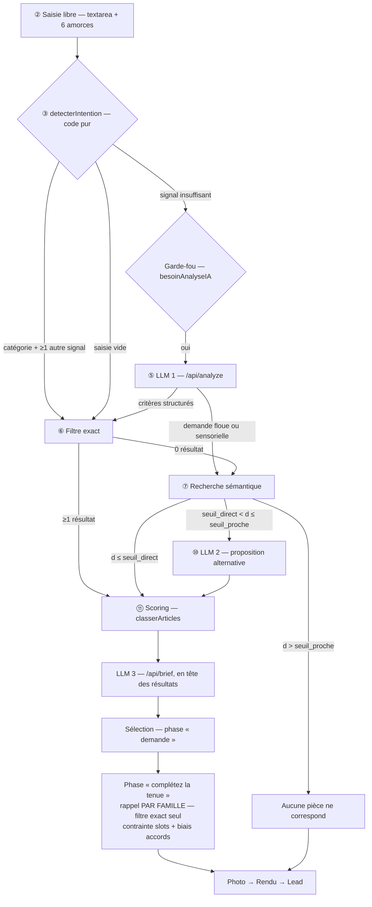

# Récupération catalogue — noyau commun aux deux widgets

**Suite de `note-cadrage-widget.md`.** Cette note traite l'**axe 1** (« Récupération d'infos ») et
la **question ouverte n°4** (« taille de catalogue au-delà de laquelle les whitelists en prompt ne
tiennent plus »), sous la contrainte posée par le §6 : **un seul noyau, plusieurs clients**.

Elle répond à deux questions liées : *quelle structure de base vectorielle, et qu'est-ce qu'on met
dedans ?* — et *comment cette structure sert les deux widgets sans se dédoubler ?*

Aucun développement à ce stade.

---

## 1. Le problème, correctement posé

Le widget appelle déjà le LLM **une seule fois par demande** (`/api/analyze`), jamais par objet. Ce
n'est donc pas le nombre d'appels IA qu'il faut réduire — il est déjà minimal.

Le problème est le **rappel à l'échelle**. `classerArticles` (`src/lib/matching.ts:33`, et son
équivalent `rankCatalogue` côté galerie) boucle sur un tableau TypeScript chargé en mémoire côté
client. À 3 000–50 000 SKU, ce modèle casse sur trois points distincts :

| Ce qui casse | Où | Pourquoi |
|---|---|---|
| Le catalogue ne tient plus dans le bundle | `src/data/catalogue.ts` | 50 000 fiches ≠ un fichier TS livré au navigateur |
| Les whitelists explosent le prompt | `api/analyze.ts:79-83`, dérivées en `catalogue.ts:932-944` | `VOCABULAIRE_*` est une **projection du catalogue**, il grandit avec lui |
| Le scoring rate tout ce qui n'est pas littéral | `matching.ts:68-75` | Comparaison de sous-chaînes : « cet été », « chic sans être guindé » ne matchent rien |

**L'invariant ne bouge pas** : *la recommandation ne sort jamais du LLM — elle sort du catalogue via
un scoring en code.* Le vecteur fait du **rappel**, jamais du **classement**.

---

## 2. Le flow : une colonne vertébrale, deux instanciations

### 2.1 Le noyau — identique pour les deux widgets

```
① Ouverture du widget
② [POINT DE VARIATION — pré-qualification, cf. 2.2]
③ Saisie — demande libre
④ Détection par mots-clés — CODE PUR
   ├─ signal suffisant ──────────────────────────────────► ⑥
   ├─ saisie vide ───────────────────────────────────────► ⑥ (défauts du tenant)
   └─ signal insuffisant ──► GARDE-FOU « appel LLM nécessaire ? »
                               └─ oui ──► ⑤
⑤ LLM 1 — compréhension du besoin (JSON contraint)
   ├─ critères structurés ──────────────────────────────► ⑥
   └─ demande floue / sensorielle ──────────────────────► ⑦
⑥ Recherche directe — FILTRE EXACT
     universels + facettes + [POINT DE VARIATION — contraintes dures du moteur déclaré]
   ├─ ≥ 1 résultat ─────────────────────────────────────► ⑪
   └─ 0 résultat ───────────────────────────────────────► ⑦
⑦ Recherche sémantique — BASE VECTORIELLE
   ├─ correspondance directe ───────────────────────────► ⑪
   ├─ correspondance proche ──► ⑩ LLM 2 — proposition alternative ──► ⑪
   └─ aucun résultat même approché ──► « aucune correspondance disponible » ──► ⑫
⑪ Scoring et classement — CODE, 0 $
⑫ Présentation, puis [POINT DE VARIATION — second temps de sélection]
```

**Ce que ce flow décide, et qui structure tout le reste** : le vectoriel est un **recours**, pas un
canal permanent. Il ne se déclenche que sur deux portes — demande floue/sensorielle (⑤→⑦) ou filtre
exact bredouille (⑥→⑦). Trois conséquences :

1. **Pas de fusion hybride permanente.** Plus simple et moins cher qu'un hybride systématique. Un
   parcours nominal ne paie **aucun embedding**.
2. **Il faut deux seuils de distance, pas un.** L'étape ⑨ a **trois** sorties (§7.3).
3. **Point faible connu.** Une demande *mixte* — « un costume **en lin**, léger, pour un mariage
   **en plein soleil** » — produit un signal fiable en ④, part en ⑥, trouve des résultats, et **ne
   touche jamais le vecteur** : la moitié sensorielle est perdue. Voir §10.

### 2.2 Les points de variation — le contrat à déclarer par client

| # | Point | Galerie | PAP | Porté par |
|---|---|---|---|---|
| ② | Pré-qualification | Choix du type — sculpture / peinture | **Aucune** : saisie unique, 6 amorces en pré-remplissage doux | `config.etapes[]` |
| ④ | Signal de certitude | **Artiste reconnu** (nom propre, très haute précision) | Catégorie + ≥ 1 autre signal (`besoinAnalyseIA`) | `vocabulaire` + règle du tenant |
| ⑤ | Dimensions du besoin | `tag`, `artiste`, `prix`, `dims`, `orientation` | `categorie`, `occasion`, `matiere`, `couleur`, `coupe`, `budget` | `vocabulaire` → `responseSchema` |
| ⑥ | **Contrainte dure** | **Physique** : `dims ≤ mur mesuré` — la photo est une **entrée du matching** | **Aucune au 1ᵉʳ passage** : la photo n'alimente que le rendu | **Moteur de contrainte** (§5.3) |
| ⑪ | Pondérations du scoring | Artiste, taille, couleur | Occasion +40, matière +25, couleur +20, mots-clés +15, coupe +10 | `config.scoring` |
| ⑫ | Second temps | Carrousels par artiste | **« Complétez la tenue »** : rappel par famille, contrainte `slots`, biais `accords` | **Moteur de contrainte** (§5.3) |

**Le seul écart structurel est le moteur de contrainte** — exactement ce que le cadrage §4.2 avait
identifié. Tout le reste est de la configuration.

### 2.3 L'instanciation PAP

Deux adaptations que le flow galerie ne couvre pas :

- **② disparaît.** La demande libre est la seule entrée. Conséquence assumée : la catégorie n'est
  pas toujours connue, donc la porte ⑤→⑦ vers le vectoriel sert plus souvent qu'en galerie.
- **⑫ porte un second temps de matching**, absent du flow galerie : la phase « complétez la tenue »
  (`StepSelection.tsx:207` et `:254`) relance un classement **par famille**. Point important pour le
  dimensionnement : **ce second temps n'a jamais besoin du vectoriel**, parce que la catégorie y est
  *imposée par le code*, pas exprimée par le visiteur. Filtre exact pur, toujours.



---

## 3. Le moteur : Postgres + pgvector

Aucun des deux repos n'a de base de données : `package.json` ne contient que `@google/genai`,
`@vercel/edge-config` et React. Il en faut une de toute façon — catalogue, stock, leads
(`StepLead.tsx:24` n'envoie rien aujourd'hui), tenants. Ajouter Pinecone/Qdrant, c'est ajouter un
**second** système et un problème de double écriture.

| Critère | Postgres + pgvector | Base vectorielle dédiée |
|---|---|---|
| Base manquante | **La résout** | Ne résout rien — il faut *quand même* un Postgres |
| Étapes ⑥ et ⑦ | **Le même moteur** : une connexion, un schéma, un `EXPLAIN` | ⑥ en SQL, ⑦ ailleurs → deux systèmes pour un flow qui bascule de l'un à l'autre |
| Contraintes dures | Le moteur physique (`dims ≤ mur`) est une **inégalité SQL** indexable, jointe au même endroit | Filtre metadata plat : les inégalités multiples y sont mal servies |
| Multi-tenant | `tenant_id` + partitionnement + RLS — **un seul cluster pour tous les clients** | Namespaces, mais le relationnel reste ailleurs |
| Cohérence | Produit + vecteur dans un `BEGIN` — la sync incrémentale (§6) est transactionnelle | Deux systèmes, vecteurs orphelins possibles |
| Coût à 50 k SKU | `halfvec(768)` ≈ 76 Mo + HNSW ≈ 85 Mo → palier gratuit | ~25 $/mois **en plus** du Postgres |

Le flow en cascade renforce l'argument : ⑥ est du SQL relationnel pur, ⑦ du vectoriel, et les deux
lisent le même catalogue. **Porte de sortie** : toute la récupération est isolée derrière
`api/_lib/retrieval.ts` — changer de moteur = réécrire ce fichier, rien d'autre.

Accès : `@neondatabase/serverless` (HTTP, pas de pool TCP à épuiser depuis les fonctions Vercel).

---

## 4. Ce qu'on met dans le vecteur

### 4.1 Trois destinations selon la nature du champ

| Nature du champ | Destination | Sert à | Galerie | PAP |
|---|---|---|---|---|
| Contrainte **binaire ou numérique** | Colonne SQL + index | ⑥ | `prix`, `dims`, `orientation` | `prix`, `disponible`, `tailles` |
| Vocabulaire **contrôlé**, exact | `facettes text[]` + GIN | ⑥ | `art:picasso`, `tag:peinture` | `occ:mariage-invite`, `mat:lin` |
| Langage **nuancé**, ouvert | **Vecteur** | ⑦ | ambiance, geste, courant | saisonnalité, registre, matière ressentie |

Un prix ne s'embarque pas : c'est un filtre. Une occasion codée `mariage-invite` non plus : c'est
une facette exacte, traitée en ⑥. **Le vecteur ne porte que ce que ni le filtre ni le mot exact ne
savent attraper** — exactement le périmètre de l'étape ⑦.

### 4.2 La phrase canonique — un gabarit par tenant

Surtout **pas** la fiche fournisseur brute (`REF-3345 / 100% LIN / DOUBLURE VISCOSE / LAVAGE 30°`) :
elle dilue le signal. On compose une phrase française qui **ressemble à une demande de client**,
puisque c'est à une demande de client — floue, sensorielle — qu'elle sera comparée en ⑦.

Le gabarit est **de la configuration**, pas du code : c'est lui qui rend `texteEmbarque.ts` commun
aux deux widgets.

```
PAP      {nom}. {catégorie}. Convient pour {occasions}.
         Matière {matiere} — {saison et chaleur en clair}. Couleur {couleur}. Coupe {coupe}. Motif {motif}.
         {description_courte}
         Registre : {formalité en clair}. Style : {mots_cles}. Se porte avec {familles des accords}.

Galerie  {titre}, {artiste}. {tag}. {technique}, {dimensions en clair}.
         {description_courte}
         Ambiance : {mots_cles}. S'accorde à {registres d'intérieur}.
```

Rendu PAP pour `c4` (costume lin beige) :

> « Costume deux-pièces en lin. Costume. Convient pour un mariage (invité), une cérémonie, le
> quotidien. Matière lin — léger, respirant, pour l'été et les fortes chaleurs. Couleur beige sable.
> Coupe regular. Motif uni. Lin lavé beige sable, veste déstructurée : le costume d'un mariage en
> extérieur, en plein soleil. Registre : habillé sans être formel. Style : été, mariage, extérieur,
> décontracté-chic. Se porte avec une chemise, des chaussures, un accessoire. »

**Règles d'or — valables pour toute verticale**

- Vocabulaire écrit en **langage naturel** (`vocabulaire.libelle`), jamais en slug : un embedding
  travaille sur la langue, pas sur `mariage-invite`.
- **Dériver et écrire en clair** ce que le visiteur exprimera sans le nommer : saison et chaleur
  depuis la matière (PAP), échelle et impact depuis les dimensions (galerie).
- **Exclure** : les nombres qui sont des filtres (`prix`, `dims` brutes), les identifiants (`id`,
  `sku`), et surtout `descriptionRendu` — fragment de prompt image, autre métier, bruit pur ici.
- Cible **80–150 tokens**. Au-delà, le vecteur se moyenne, perd son pouvoir discriminant, et les
  seuils de ⑨ deviennent inexploitables.
- Le texte composé est **stocké** (`article_vecteur.texte_source`) : quand ⑦ surprend, on lit ce qui
  a réellement été indexé.

---

## 5. Le schéma

### 5.1 Fondations

```sql
CREATE EXTENSION IF NOT EXISTS vector;
CREATE EXTENSION IF NOT EXISTS unaccent;
CREATE EXTENSION IF NOT EXISTS pg_trgm;

-- Recherche FR insensible aux accents — miroir SQL de normaliser() (src/lib/intent.ts:11)
CREATE TEXT SEARCH CONFIGURATION fr_unaccent (COPY = french);
ALTER TEXT SEARCH CONFIGURATION fr_unaccent
  ALTER MAPPING FOR hword, hword_part, word WITH unaccent, french_stem;

CREATE TABLE tenant (
  id   uuid PRIMARY KEY DEFAULT gen_random_uuid(),
  slug text UNIQUE NOT NULL,                    -- 'andre-laurent', 'galeries-bartoux'
  nom  text NOT NULL,
  moteur_contrainte text NOT NULL DEFAULT 'aucun'
    CHECK (moteur_contrainte IN ('aucun','physique','combinatoire')),   -- cf. §5.3
  modele_embedding text NOT NULL DEFAULT 'gemini-embedding-001',        -- VERROUILLÉ, cf. §8.3
  dims_embedding   int  NOT NULL DEFAULT 768,
  seuil_direct     real NOT NULL DEFAULT 0.35,  -- ⑨ « correspondance directe »
  seuil_proche     real NOT NULL DEFAULT 0.55,  -- au-delà → « aucun résultat »
  gabarit_embedding text NOT NULL DEFAULT '',   -- la phrase canonique (§4.2)
  config jsonb NOT NULL DEFAULT '{}'::jsonb,    -- marque, étapes déclarées, pondérations du scoring
  cree_le timestamptz NOT NULL DEFAULT now()
);

-- Les VOCABULAIRE_* deviennent une donnée curée par tenant, au lieu d'une projection
-- du catalogue. Les synonymes remplacent MOTS_CATEGORIE / MOTS_OCCASION /
-- SYNONYMES_COULEUR codés en dur (intent.ts:41-130) : l'étape ④ devient configurable,
-- donc commune aux deux widgets.
CREATE TABLE vocabulaire (
  tenant_id uuid NOT NULL REFERENCES tenant(id) ON DELETE CASCADE,
  dimension text NOT NULL,   -- 'categorie','occasion','matiere','couleur','artiste','technique'…
  terme     text NOT NULL,   -- canonique : 'mariage-invite'
  libelle   text NOT NULL,   -- naturel : 'un mariage (invité)' — prompt ET texte embarqué
  prefixe   text NOT NULL,   -- 'occ' → produit la facette 'occ:mariage-invite'
  synonymes text[] NOT NULL DEFAULT '{}',
  ordre     int NOT NULL DEFAULT 0,
  PRIMARY KEY (tenant_id, dimension, terme)
);
```

`dimension` est libre, pas une énumération : c'est ce qui permet à une troisième verticale
d'apparaître sans migration. Le `responseSchema` de ⑤ est **généré** depuis cette table.

### 5.2 `article` — le noyau universel

Aucune colonne spécifique à une verticale. Ce qui varie vit dans `attributs` (typé, rendu dans la
projection, lu par le scoring) et dans `facettes[]` (dérivé, indexé, lu par le filtre ⑥).

```sql
CREATE TABLE article (
  id          uuid PRIMARY KEY DEFAULT gen_random_uuid(),
  tenant_id   uuid NOT NULL REFERENCES tenant(id) ON DELETE CASCADE,
  ref_externe text NOT NULL,               -- id du scraping / Shopify / CSV ; 'c1' en démo

  -- Identité / présentation — commun aux deux (cadrage §4.1)
  nom text NOT NULL,                       -- PAP: nom · galerie: titre
  categorie text NOT NULL,                 -- PAP: 7 familles · galerie: tag (2 valeurs)
  image text, gradient text,
  description_courte text,
  description_rendu text,                  -- fragment de prompt image, JAMAIS embarqué (§4.2)
  url_produit text,

  -- Dimensions déclarées par le tenant — c'est ici que les deux verticales divergent
  -- PAP     : {matieres:[…], couleurs:[…], occasions:[…], coupe, saisons:[…],
  --            formalite, chaleur, motif, slots:[…], tailles:[…]}
  -- Galerie : {artiste, technique, orientation, courant, motsCles:[…]}
  attributs jsonb NOT NULL DEFAULT '{}',

  -- Commerce (absent aujourd'hui — cf. cadrage §6, « synchro stock »)
  prix numeric(10,2) NOT NULL, prix_barre numeric(10,2), devise char(3) DEFAULT 'EUR',
  actif boolean DEFAULT true,
  disponible boolean DEFAULT true,         -- ≥ 1 variante en stock (trigger)
  stock_total int DEFAULT 0,

  -- Synchronisation incrémentale (§6)
  source text DEFAULT 'scraping',
  contenu_hash text DEFAULT '',            -- hash des champs BRUTS → skip du LLM si inchangé
  scraping_id uuid, dernier_vu_le timestamptz,
  enrichi_par text, enrichi_le timestamptz, confiance real,
  statut text DEFAULT 'publie' CHECK (statut IN ('brouillon','a_valider','publie')),

  -- Canaux du filtre exact ⑥ — dérivés de `attributs` par le trigger d'ingestion
  facettes text[],   -- 'occ:mariage-invite','mat:lin' · 'art:picasso','tech:huile'
  tsv tsvector,      -- nom || description_courte || libellés des facettes

  maj_le timestamptz DEFAULT now(),
  UNIQUE (tenant_id, ref_externe)
);

CREATE INDEX ON article (tenant_id, categorie, prix) WHERE actif AND disponible;
CREATE INDEX ON article USING gin (facettes);            -- ⑥ : UN index pour toutes les dimensions
CREATE INDEX ON article USING gin (tsv);
CREATE INDEX ON article USING gin (attributs jsonb_path_ops);
CREATE INDEX ON article USING gin (nom gin_trgm_ops);
```

> **Piège à l'écriture** : `facettes` et `tsv` sont naturellement des colonnes générées, mais
> Postgres refuse les sous-requêtes (`array_agg` sur `unnest`) dans un `GENERATED ALWAYS AS` et
> exige une configuration de recherche `IMMUTABLE`. Les deux seront renseignées par le trigger
> d'ingestion. Ne pas supposer que la version naïve passe.

### 5.3 Les deux moteurs de contrainte — le seul vrai bloc divergent

Le cadrage §4.2 les identifie ; ils deviennent ici **deux tables, activées par
`tenant.moteur_contrainte`**. Une troisième verticale tombera dans l'une ou l'autre.

```sql
-- MOTEUR PHYSIQUE (continue) — galerie, mobilier, cuisine, immobilier.
-- La photo est une ENTRÉE DU MATCHING : elle mesure l'espace, ⑥ élimine ce qui n'y tient pas.
-- Colonnes réelles et non jsonb : ce sont des inégalités, elles doivent s'indexer.
CREATE TABLE contrainte_physique (
  article_id uuid PRIMARY KEY REFERENCES article(id) ON DELETE CASCADE,
  tenant_id  uuid NOT NULL,
  hauteur_cm numeric(8,1), largeur_cm numeric(8,1), profondeur_cm numeric(8,1),
  orientation text CHECK (orientation IN ('portrait','paysage','carre'))
);
CREATE INDEX ON contrainte_physique (tenant_id, hauteur_cm, largeur_cm);

-- MOTEUR COMBINATOIRE (discrète) — PAP, joaillerie, optique, packs B2B.
-- La photo n'alimente que le RENDU. La contrainte n'intervient pas en ⑥ mais en ⑫ :
-- deux articles qui revendiquent le même emplacement ne se bloquent pas, ILS SE REMPLACENT
-- (tenue.ts), et l'UI l'explique. Les `slots` vivent dans article.attributs ;
-- seuls les accords, relationnels, méritent leur table.
CREATE TABLE article_accord (
  tenant_id  uuid NOT NULL,
  article_id uuid REFERENCES article(id) ON DELETE CASCADE,
  accord_id  uuid REFERENCES article(id) ON DELETE CASCADE,
  source text DEFAULT 'manuel' CHECK (source IN ('manuel','llm','cooccurrence','visuel')),
  poids  real DEFAULT 1,
  PRIMARY KEY (article_id, accord_id)
);

-- Déclinaisons vendables — PAP: tailles · galerie: tirages/formats · null ailleurs
CREATE TABLE article_variante (
  id uuid PRIMARY KEY DEFAULT gen_random_uuid(),
  article_id uuid REFERENCES article(id) ON DELETE CASCADE,
  tenant_id uuid NOT NULL, libelle text NOT NULL,   -- '48', 'tirage 40×60'
  sku text, ean text, prix numeric(10,2), stock int NOT NULL DEFAULT 0,
  UNIQUE (article_id, libelle)
);
```

**Conséquence sur ⑥** : la requête du filtre exact est commune, et le moteur déclaré y ajoute
**une clause, pas une branche** — une jointure `contrainte_physique` avec deux inégalités côté
galerie, rien côté PAP au premier passage.

### 5.4 `article_vecteur` — identique pour toutes les verticales

```sql
CREATE TABLE article_vecteur (
  article_id   uuid NOT NULL REFERENCES article(id) ON DELETE CASCADE,
  modele       text NOT NULL,                 -- dans la PK : deux modèles cohabitent
  type         text NOT NULL DEFAULT 'texte' CHECK (type IN ('texte','image')),
  dims         int  NOT NULL,
  vecteur      halfvec(768) NOT NULL,
  texte_source text NOT NULL DEFAULT '',      -- le texte réellement embarqué — auditable
  source_hash  text NOT NULL,                 -- ré-embarquer seulement si le texte a changé

  -- Colonnes de filtre DÉNORMALISÉES. Load-bearing : le WHERE et le ORDER BY doivent
  -- porter sur la MÊME table, sinon l'index HNSW ne sert à rien.
  tenant_id uuid NOT NULL, categorie text NOT NULL, prix numeric(10,2) NOT NULL,
  disponible boolean DEFAULT true, actif boolean DEFAULT true,

  PRIMARY KEY (article_id, modele, type)
);

CREATE INDEX article_vecteur_hnsw ON article_vecteur
  USING hnsw (vecteur halfvec_cosine_ops) WITH (m = 16, ef_construction = 64);
CREATE INDEX article_vecteur_filtre ON article_vecteur
  (tenant_id, modele, type, categorie, disponible, prix);

-- Le prix et le stock bougent tous les jours : la dénormalisation ne doit pas dériver.
CREATE TRIGGER article_maj_filtres AFTER UPDATE OF categorie, prix, disponible, actif, statut
  ON article FOR EACH ROW EXECUTE FUNCTION sync_vecteur_filtres();
```

**Trois raisons de sortir le vecteur de `article`** : ① migration de modèle sans coupure (indexer
sous un nouveau `modele` pendant que l'ancien sert le trafic, puis basculer le tenant) ; ② `type`
dans la PK ouvre l'embedding image (§11) sans migration ; ③ la sync incrémentale manipule les
vecteurs seuls, sur une table étroite, sans toucher `article`.

### 5.5 Embedding — les détails qui font mal

| Choix | Valeur | Raison |
|---|---|---|
| Fournisseur | **Gemini**, `@google/genai` déjà en dépendance des deux repos | Aucun second fournisseur IA à introduire |
| Dimension | **768** via `outputDimensionality` | 4× moins de stockage que 3072, perte quasi nulle (MRL) |
| Type SQL | **`halfvec(768)`** | HNSW plafonne à 2 000 dims sur `vector`, 4 000 sur `halfvec`. **3072 serait non indexable** |
| Distance | cosinus (`<=>`, `halfvec_cosine_ops`) | Métrique des seuils de ⑨ |
| `task_type` | `RETRIEVAL_DOCUMENT` à l'ingestion, `RETRIEVAL_QUERY` en ⑦ | Asymétrie souvent oubliée, elle pèse lourd sur la qualité |
| **Piège** | **Re-normaliser en L2** après troncature MRL | Seule la sortie 3072 est pré-normalisée. Tronquer à 768 sans renormaliser fausse **silencieusement** toutes les distances — donc les seuils de ⑨ |

**Coûts** : premier run 50 000 produits × ~120 tokens ≈ 6 M tokens → ~1 $. Runs suivants : seuls les
produits « changés » (§6). Une requête ⑦ ≈ 30 tokens → ~0,000006 $, **et seuls les parcours qui
atteignent ⑦ la paient**. Les 6 amorces de `StepRequest.tsx` ont leur vecteur précalculé → 0 $.

---

## 6. Ingestion : synchronisation incrémentale par hash

```
catalogue.json  (scraping / export client)
  │ pour chaque produit : contenu_hash = hash(champs BRUTS fournisseur)
  ├─ NOUVEAU   (ref absente en base)      ──► enrichissement LLM + embedding + INSERT vecteur
  ├─ CHANGÉ    (hash différent)           ──► ré-enrichissement + ré-embedding + UPDATE vecteur
  ├─ INCHANGÉ  (hash identique)           ──► AUCUNE ACTION — 0 appel LLM, 0 $
  └─ ORPHELIN  (en base, absent du .json) ──► DELETE vecteur + article.actif = false
```

C'est ce bloc qui rend le coût d'exploitation tenable : sur 50 000 SKU re-scrapés quotidiennement,
seules les quelques centaines de fiches réellement modifiées paient un appel LLM.

**Détection des orphelins** : chaque run porte un `scraping_id` ; tout produit vu est marqué
`dernier_vu_le = now()`. Les orphelins sont ceux dont `dernier_vu_le < début du run`.

> **Garde-fou obligatoire.** Un scraping qui échoue à moitié (site en maintenance, sélecteur cassé,
> rate-limit) renvoie un `catalogue.json` tronqué — et la règle orpheline **supprimerait alors la
> moitié du catalogue**. Le run doit **avorter sans rien supprimer** si le nombre de produits vus
> tombe sous un seuil du run précédent (ex. 90 %), et journaliser l'écart pour validation humaine.
> C'est la panne la plus coûteuse de tout le dispositif.

> **Suppression douce.** On supprime le **vecteur** — l'article sort du rappel immédiatement, ⑥ et ⑦
> ne le voient plus — mais on garde la ligne `article` en `actif = false` : un lead ou une tenue
> composée peuvent y faire référence, et une reprise de stock la réactive sans ré-enrichissement si
> le hash n'a pas bougé.

### 6.1 L'enrichissement produit — commun, piloté par le vocabulaire

Même mécanique que `/api/analyze`, mais appliquée au **produit** au lieu de la demande. Le
`responseSchema` est **généré depuis `vocabulaire`** : c'est ce qui rend l'enrichissement commun aux
deux widgets sans branche dans le code.

**Règles non négociables** — ce sont elles qui préservent l'invariant :

- Le LLM **ne fixe jamais** `prix`, `stock`, `variantes`, `ref_externe`, `image`, ni aucune valeur
  du moteur de contrainte physique (`dims`) : ces champs viennent du flux, tels quels. Un modèle qui
  inventerait les dimensions d'une œuvre casserait le filtre ⑥ de la galerie en silence.
- Toute valeur est re-filtrée contre la whitelist du tenant, exactement comme `filtrerWhitelists`
  (`api/analyze.ts:153`). **Un terme halluciné reste impossible.**
- `confiance < 0,6` → `statut = 'a_valider'` : le produit **n'est pas recommandable** tant qu'un
  humain n'a pas validé. C'est le crochet du « score de préparation données » (cadrage §6).
- Prompt à deux niveaux, comme les autres : squelette dans le code, section TÂCHES éditable via
  `enrichInstructions` dans `PromptConfig` (`api/_lib/promptStore.ts`), exposé sur `/admin`.

**Exécution** : pas dans une fonction Vercel (plafond 60 s). Un script `scripts/ingerer.mjs` calqué
sur `scripts/generer-photos.mjs`, concurrence 5–10, backoff, reprise. Modèle Flash : ~800 tokens in
/ 250 out par produit → 50 000 produits pour quelques dizaines de dollars **au premier run**.

---

## 7. Les requêtes du flow

### 7.1 ⑥ Recherche directe — filtre exact, aucun vecteur

```sql
SELECT <projection allégée>
FROM article a
LEFT JOIN contrainte_physique c ON c.article_id = a.id      -- inerte si moteur ≠ 'physique'
WHERE a.tenant_id = $1 AND a.actif AND a.disponible AND a.statut = 'publie'
  AND a.categorie = ANY($2)
  AND ($3::text[] IS NULL OR a.facettes @> $3)              -- toutes les facettes exigées
  AND ($4::numeric IS NULL OR a.prix <= $4 * 1.5)
  -- POINT DE VARIATION : contrainte dure du moteur déclaré
  AND ($6::numeric IS NULL OR c.hauteur_cm <= $6)           -- galerie : mur mesuré
  AND ($7::numeric IS NULL OR c.largeur_cm <= $7)
ORDER BY (SELECT count(*) FROM unnest(a.facettes) f WHERE f = ANY($5)) DESC, a.prix
LIMIT 200;
```

Une requête, deux verticales : côté PAP `$6`/`$7` sont `NULL` et les clauses s'effacent.
**0 ligne → bascule en ⑦**, c'est la porte « 0 résultat » du flow.

### 7.2 ⑦ Recherche sémantique — le recours

```sql
SET LOCAL hnsw.ef_search = 100;
SET LOCAL hnsw.iterative_scan = 'relaxed_order';   -- pgvector ≥ 0.8, indispensable en recherche filtrée

SELECT v.article_id, v.vecteur <=> $3::halfvec AS distance
FROM article_vecteur v
WHERE v.tenant_id = $1 AND v.modele = $2 AND v.type = 'texte' AND v.actif AND v.disponible
  AND ($4::text[] IS NULL OR v.categorie = ANY($4))   -- catégorie relâchée si ⑥ a échoué
  AND ($5::numeric IS NULL OR v.prix <= $5 * 1.5)     -- garde-fou de rappel, PAS la règle métier
ORDER BY v.vecteur <=> $3::halfvec
LIMIT 200;
```

### 7.3 ⑨ Les trois sorties — le paramètre le plus délicat

Une recherche vectorielle renvoie **toujours** un plus proche voisin, même absurde. Sans seuils, la
branche « aucun résultat même approché » ne se déclencherait **jamais**, et le widget proposerait un
costume à qui cherche une robe de mariée.

| Distance du meilleur résultat | Sortie ⑨ | Suite |
|---|---|---|
| `d ≤ seuil_direct` (0,35) | Correspondance **directe** | → ⑪ scoring |
| `seuil_direct < d ≤ seuil_proche` (0,55) | **Proche**, pas exacte | → ⑩ LLM 2 → ⑪ |
| `d > seuil_proche` | **Aucun résultat** | → « aucune correspondance disponible » → ⑫ |

Points de départ à calibrer sur le jeu doré (§8.4) : ils dépendent du modèle, de la longueur du
texte embarqué et de la verticale — d'où leur place dans `tenant`, réglables sans redéploiement.

> **Frontière à tenir côté PAP** : l'état vide se déclenche sur **absence de candidat**, jamais sur
> le budget. La règle « une sélection vide est une impasse ; une sélection honnêtement étiquetée
> laisse le visiteur décider » (`matching.ts:97-105`) reste intacte : un plafond intenable affiche
> les pièces avec le badge « Au-dessus de votre budget », il ne vide pas l'écran.

### 7.4 ⑩ LLM 2 — proposition alternative

Même contrat que `/api/brief` : il explique *pourquoi* on propose autre chose (« vous cherchiez du
velours ; il n'y en a pas cette saison, voici deux laines à la main comparable »). Il **ne choisit
pas** les articles — ils viennent de ⑦ puis ⑪. À implémenter comme un **mode de `/api/brief`**
plutôt qu'un quatrième endpoint : même forme, même garde-fous, un prompt de plus dans le store.

### 7.5 Latence

Parcours nominal (④→⑥→⑪) : aucun embedding, une requête SQL indexée, **5–20 ms**.
Parcours de recours (⑦) : embedding 80–250 ms + HNSW 2–10 ms → **150–350 ms**.
`StepMatching.tsx:51-82` enchaîne déjà des `delai(800/700/500/600)` **artificiels** : les deux
tiennent dans l'animation existante, et « Recherche dans la collection… » devient une vraie phase.

---

## 8. Invariants et vérification

### 8.1 Dégradation gracieuse — le principe est étendu, pas contourné

| Panne | Comportement |
|---|---|
| `DATABASE_URL` absente | Repli sur le catalogue statique → **comportement d'aujourd'hui à l'identique**, comme l'absence de `GOOGLE_API_KEY` |
| Base injoignable (timeout 1 200 ms) | Idem. Jamais d'écran d'erreur |
| Embedding en échec | **⑦ désactivée**, le parcours s'arrête à ⑥. La cascade dégrade naturellement : on perd le recours, pas le service |
| Tenant réel 50 k SKU, base absente | Repli sur un jeu de secours de 200 articles curés, livré dans la config du tenant |

### 8.2 La recommandation ne sort toujours pas du LLM

⑦ choisit *qui est scoré*, jamais l'ordre final ; ⑩ rédige une explication, ne sélectionne rien. Le
filtre budget en ⑥/⑦ est `prix <= budget * 1,5`, un **garde-fou de rappel** : la règle métier reste
dans le code. **Interdiction d'afficher une distance** (« proximité 0,87 ») : non explicable à un
client — les `raisons[]` restent celles que le code sait justifier.

### 8.3 Le piège des embeddings — contredit un pattern déjà présent

`api/_lib/gemini.ts` implémente `avecMeilleurModele()`, une cascade qui bascule de modèle sur
404/403/429. **Ce pattern est faux pour les embeddings** : un vecteur produit par le modèle A est
incomparable à un index construit avec B. La cascade ne renverrait pas une réponse dégradée mais des
résultats **silencieusement absurdes**, et les seuils de ⑨ n'auraient plus aucun sens.

> Le modèle d'embedding est **épinglé** par `tenant.modele_embedding`. En cas d'indisponibilité, on
> **désactive ⑦** et on sert sur ⑥. On ne cascade **jamais**. Changer de modèle = ré-indexer sous un
> nouveau `modele`, puis basculer le tenant.

### 8.4 Jeu doré — comble aussi le trou « Éval : Néant » (cadrage §7 axe 4)

25–30 paires `(demande → refs attendues)` **par verticale**, en trois familles correspondant aux
trois chemins du flow : demandes structurées (doivent partir en ⑥), sensorielles (en ⑦), hors
catalogue (état vide). Métriques :

- **Taux d'aiguillage correct** ④/⑤ → ⑥ vs ⑦ : la santé de la cascade elle-même.
- **Rappel@200** de ⑥ et ⑦ contre un balayage exhaustif : critère **≥ 0,99**.
- **Calibrage des seuils ⑨** : aucune demande hors catalogue ne doit passer en « directe » ; aucune
  demande sensorielle valide ne doit tomber en « aucun résultat ».
- **Précision@5 du classement final** : doit rester **strictement stable** avant/après. Toute
  variation signale une fuite du vecteur dans le classement — un bug, pas une amélioration.

---

## 9. Ce que ça change pour l'extraction du noyau

Le cadrage §5 mesure le problème : *« l'architecture s'est transférée à 100 %, le code à 0 % »*,
≈ 3 % de réutilisation littérale. Cette couche est l'occasion de commencer l'extraction **par le
bas**, là où la divergence est la plus faible :

| Brique | Commun ? | Ce qui varie |
|---|---|---|
| `db.ts`, migrations, `article_vecteur` | **100 %** | rien |
| `embeddings.ts` | **100 %** | le modèle épinglé, par tenant |
| `texteEmbarque.ts` | **100 %** | le gabarit, donnée du tenant (§4.2) |
| `enrichir.ts` | **100 %** | le `responseSchema`, généré depuis `vocabulaire` |
| `retrieval.ts` | **~90 %** | une clause de contrainte dure, pas une branche (§7.1) |
| Scoring (`classerArticles` / `rankCatalogue`) | **~70 %** | les pondérations, données du tenant |
| Moteur de contrainte (`tenue.ts` / `placement.ts`) | **0 %** | **c'est le bloc divergent, et il est isolé** |

Autrement dit : la couche de récupération est **le meilleur candidat au noyau partagé** — elle est
commune presque partout, et la seule divergence y est déjà nommée et bornée. C'est un chantier qui
sert les deux widgets au lieu d'en servir un.

**Ordre suggéré** : construire cette couche pour PAP d'abord (catalogue plus riche, vocabulaire plus
large, donc le cas le plus exigeant), puis brancher la galerie dessus. Si le branchement de la
galerie ne demande que de la config — un gabarit, un vocabulaire, un moteur de contrainte déclaré —
la frontière est validée empiriquement. Sinon elle est fausse, et il vaut mieux le savoir sur deux
widgets que sur cinq.

---

## 10. À trancher

1. **Cascade stricte ou pont sémantique.** Une demande mixte part en ⑥ et ne touche jamais le
   vecteur (§2.1). Trois options : (a) cascade stricte comme dessinée — la moins chère, la plus
   prévisible ; (b) ⑥ puis **re-classement vectoriel à l'intérieur** de l'ensemble filtré quand la
   demande porte du texte résiduel non consommé par ④ — un embedding de plus, le filtre exact reste
   maître ; (c) fusion parallèle systématique — la plus chère, la moins lisible.
2. **Seuils initiaux.** 0,35 / 0,55 sont des points de départ, crédibles seulement après le premier
   passage du jeu doré.
3. **Verticale n°2 du cadrage §10.** Si c'est le mobilier (contrainte physique), la table
   `contrainte_physique` est réutilisée telle quelle et la frontière est confirmée à moindres frais.
   Si c'est l'optique (combinatoire), c'est `article_accord` + `slots` qui sont mis à l'épreuve.

---

## 11. Option future — embedding image

`type` étant déjà dans la PK de `article_vecteur`, indexer les visuels ne demande **aucune
migration**. Usages par ordre de valeur : (a) proposer des `accords` par harmonie visuelle sur un
catalogue trop gros pour être curé à la main ; (b) « montrez-moi quelque chose comme ça » depuis une
photo ; (c) détecter les quasi-doublons à l'ingestion. En galerie, l'usage (b) est plus naturel
encore qu'en PAP — un visiteur photographie un tableau qu'il aime.

**Réserve** : la similarité visuelle n'est **pas** la complémentarité. Une veste marine est « proche »
d'un pantalon marine, mais une tenue veut de la complémentarité, pas de la ressemblance. L'embedding
image ne doit alimenter qu'une **liste de candidats** validée par une règle ou un humain.

---

## 12. Trouvé au passage

1. **`detecterIntention` ne remplit jamais `motsCles`** (`src/lib/intent.ts:202` renvoie `[]` en
   dur). Le bloc de scoring `+15 mots-clés` (`src/lib/matching.ts:68-75`) est donc **inatteignable
   en mode 100 % code** — et sur la demande d'exemple du projet, `besoinAnalyseIA` renvoie `false`,
   donc le LLM n'est pas appelé et ce score ne se déclenche jamais. **L'étape ④ du flow est
   aujourd'hui plus faible qu'elle n'en a l'air.** Correction ~10 lignes, coût 0, gain immédiat.
2. **Aucun champ n'encode la saison ni la disponibilité.** « cet été » et « en stock » sont deux
   critères que le visiteur exprime spontanément et que le modèle de données ne peut pas porter.
3. **`VOCABULAIRE_*` sont dérivés de `CATALOGUE` au build** (`catalogue.ts:932-944`) puis injectés
   dans le prompt (`api/analyze.ts:79-83`) : c'est exactement le mécanisme qui casse au-delà de
   quelques centaines de SKU — et il est dupliqué à l'identique dans les deux widgets. La table
   `vocabulaire` (§5.1) le remplace **une fois pour les deux**.
